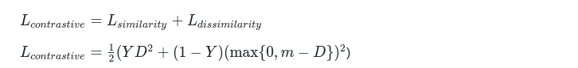

# similar-images

> Siamese Neural Networks for One-shot Image Recognition

Siamese networks were first introduced in the early 1990s by Bromley and LeCun to solve signature verification as an image matching problem. A Siamese neural network consists of twin networks which accept distinct inputs but are joined by an energy function at the top. This function computes some metric between the highest-level feature representation on each side. The parameters between the twin networks are tied. Weight tying guarantees that two extremely similar images could not possibly by mapped by their respective networks to very different locations in feature space because each network computes the same function. Also, the network is symmetric, so that whenever we present two distinct images to the twin networks, the top conjoining layer will compute the same metric as if we were to present the same two images but to the opposite twins.

> Dimensionality Reduction by Learning an Invariant Mapping

Following the work of above paper, the loss function between twin sub-networks is the contrastive loss function, a combination of similarity and dissimilarity.

in which *D* defines the parameterized euclTraining process after idean distance function between images *X1* and *X2*.

## experiment on MNIST dataset

Here is the **simple illustration** of the images in the MNIST dataset.

Training process after **100 epochs**
 
Training process after **1000 epochs**

Training process after **2000 epochs**

The inferred similar images from the learned Siamese network

## reference

Similar work refers to [github](https://github.com/ardiya/siamesenetwork-tensorflow)